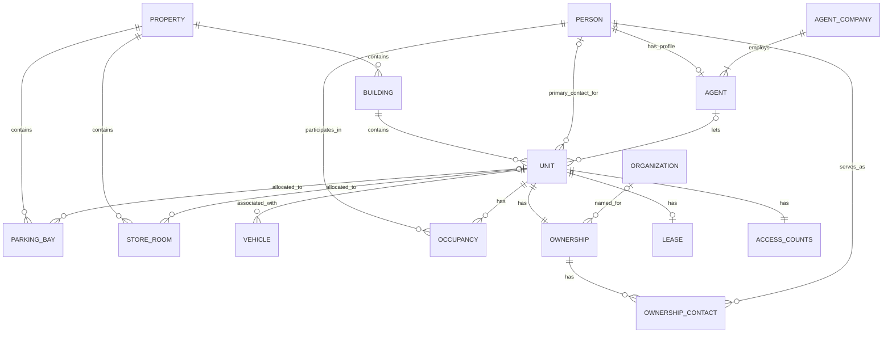

# Domain model

This document explains the concepts represented by the register. Field-level details are in the [data dictionary](data-dictionary.md), while enforceable rules are catalogued in [business rules](business-rules.md).

## Model overview

The diagram describes intended cardinality. Some requirements on the `Unit` side—particularly the mandatory existence of an ownership and access-count record—cannot be guaranteed by a child-table foreign key alone. Their precise enforcement status is recorded in the business rules.

## Property, building, and unit

A **Property** is the top-level managed place, complex, or scheme.

A **Building** is a named physical building within a property. A building belongs to exactly one property. Unit numbers are scoped to buildings because two buildings may use the same unit number.

A **Unit** is the central operational record. A unit belongs to exactly one building and may be related to people, ownership, occupation, an agent, a lease, parking bays, storerooms, vehicles, and access counts.

## People and roles

A **Person** is the canonical record for a natural person. Contact details belong here rather than being copied into every role.

The same person may participate in several ways:

- primary contact for one or more units;
- occupant of one or more units;
- ownership contact for one or more ownerships;
- letting agent, through an agent profile.

Being a primary contact does not imply ownership or occupation. It only identifies the preferred person to contact regarding a unit. A unit may temporarily have no primary contact while its register entry is incomplete.

## Occupation

**Occupancy** is one relationship between one person and one unit. It is not a household record. A household is represented by several occupancy rows sharing a unit.

A person may occupy several units simultaneously. The register is operational and does not attempt to determine anyone’s legal residence. The same person-unit pair cannot be entered twice.

## Ownership

Every unit is intended to have one current **Ownership** record. Ownership is either:

- **Natural** — no organization is attached; or
- **Juristic** — an organization must be attached.

An **Organization** represents a company, trust, or comparable juristic entity. Its registration reference is descriptive rather than globally unique because formats and issuing authorities differ between countries and organization types.

An **Ownership Contact** connects a person to an ownership. For a natural ownership, these will normally be the natural owners. For juristic ownership, they are the people who should receive owner-related communication. The register does not currently distinguish directors, trustees, representatives, or other internal roles.

An ownership may temporarily have no contacts if the register is incomplete. Several contacts may be attached, and a person may be a contact for several ownerships.

## Letting agents

An **Agent** is a role profile attached to a canonical person. The profile belongs to exactly one **Agent Company**. Freelance agents are not currently supported.

A unit may have no letting agent or one letting agent. An agent may manage several units. Removing an agent assignment from a unit does not remove the person or company record.

## Lease summary

A **Lease** is a current summary associated with at most one unit. It is not the lease document and does not store a signed document.

The lease-holder name remains free text. This is intentional: a name on a lease does not necessarily mean the HOA needs a full person record for that signatory. The declared occupant count is also a summary and is separate from the individually known occupancy records.

`PetsPresent` means pets are recorded as part of the current rental. It differs from the unit’s `PetFriendly` setting, which records whether the owner permits pets in rentals.

## Parking bays and storerooms

**Parking Bays** and **Storerooms** physically belong to a property’s shared infrastructure. They may be unallocated or assigned to at most one unit.

They belong to the property rather than directly to a building because buildings within a property may share underground or other common infrastructure. An allocation must remain within the same property.

The model records the current operational allocation. It does not presently distinguish common property, exclusive-use areas, or separately registered legal sections.

## Vehicles

A **Vehicle** is kept only while it is relevant to a unit. A vehicle must belong to one unit. Its registration is the operational identifier and must be unique in the active register.

## Access-device counts

The **Access Counts** record stores quantities of pedestrian-gate tags and parking-garage remotes distributed among owner contacts, occupants, and the letting agent.

It intentionally stores counts rather than individual device identities. The purpose is to reconcile totals during reprogramming and detect discrepancies; investigating the specific devices remains a human process.

Each unit is intended to have exactly one access-count record. A missing value means **unknown**, while zero means **confirmed none**.
